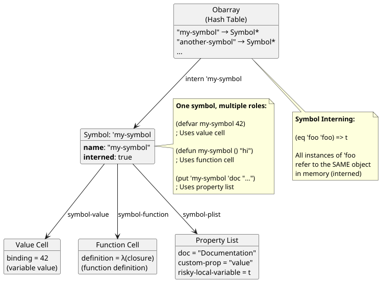
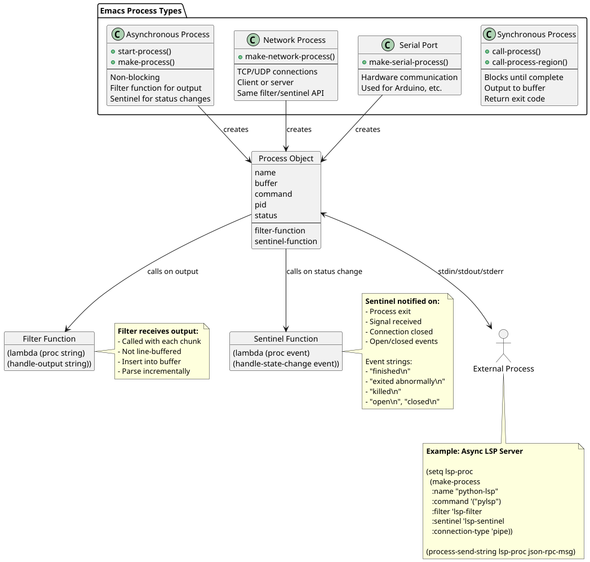

# Emacs Internals - Deep Dive

> **Technical Reference**: Low-level implementation details of Emacs internals for developers

[← Back to Architecture Overview](README.md)

---

## Table of Contents

- [Introduction](#introduction)
- [Buffer Internals](#buffer-internals)
  - [Buffer Structure](#buffer-structure)
  - [Gap Buffer](#gap-buffer)
  - [Markers](#markers)
  - [Text Properties vs Overlays](#text-properties-vs-overlays)
- [Display Engine (Redisplay)](#display-engine-redisplay)
  - [The Redisplay Algorithm](#the-redisplay-algorithm)
  - [Key Challenges](#key-challenges)
  - [Redisplay Phases](#redisplay-phases)
  - [Optimization Techniques](#optimization-techniques)
- [Garbage Collection](#garbage-collection)
  - [Implementation](#implementation)
  - [GC Phases](#gc-phases)
  - [Object Types](#object-types)
  - [GC Triggering](#gc-triggering)
  - [GC Performance Tips](#gc-performance-tips)
- [Byte-code and Compilation](#byte-code-and-compilation)
  - [Byte-code Format](#byte-code-format)
  - [Byte-code Instructions](#byte-code-instructions)
  - [Example Compilation](#example-compilation)
  - [Performance Impact](#performance-impact)
- [Native Compilation](#native-compilation)
  - [How It Works](#how-it-works)
  - [Benefits](#benefits)
  - [Configuration](#configuration)
- [Symbol Implementation](#symbol-implementation)
  - [Symbols](#symbols)
  - [Symbol Components](#symbol-components)
  - [The Obarray](#the-obarray)
- [Keymaps and Key Lookup](#keymaps-and-key-lookup)
  - [Keymap Structure](#keymap-structure)
  - [Keymap Types](#keymap-types)
  - [Key Lookup Algorithm](#key-lookup-algorithm)
  - [Prefix Keys](#prefix-keys)
- [Dynamic vs Lexical Binding](#dynamic-vs-lexical-binding)
  - [Historical Context](#historical-context)
  - [Dynamic Binding (Old Style)](#dynamic-binding-old-style)
  - [Lexical Binding (Modern)](#lexical-binding-modern)
  - [Implementation Difference](#implementation-difference)
- [Process Management](#process-management)
  - [Process Types](#process-types)
  - [Process Filters](#process-filters)
  - [Sentinel Functions](#sentinel-functions)
- [Undo System](#undo-system)
  - [Undo List Structure](#undo-list-structure)
  - [Undo Entry Types](#undo-entry-types)
  - [Example Undo List](#example-undo-list)
  - [Undo Limits](#undo-limits)
- [Syntax Tables](#syntax-tables)
  - [Syntax Classes](#syntax-classes)
  - [Using Syntax Tables](#using-syntax-tables)
- [Performance Profiling](#performance-profiling)
  - [Built-in Profiler](#built-in-profiler)
  - [Benchmark Helper](#benchmark-helper)
  - [Memory Profiling](#memory-profiling)
- [Advanced Topics](#advanced-topics)
  - [Subprocesses and PTY](#subprocesses-and-pty)
  - [Module System (Dynamic Modules)](#module-system-dynamic-modules)
  - [Tree-sitter Integration](#tree-sitter-integration)
- [Debugging Internals](#debugging-internals)
  - [Useful Commands](#useful-commands)
  - [Debug on Error](#debug-on-error)
- [Source Code Organization](#source-code-organization)
- [References](#references)

---

## Introduction

This document explores the internal implementation details of Emacs, going beyond the architectural overview to understand how specific components work at a low level. This information is essential for developers who need to work with Emacs' C core, optimize performance, or understand the implementation of advanced features.

**Complete Data Flow Overview:**


*This diagram shows how data flows through the entire Emacs system, from user input to screen output.*

[View Source: complete-data-flow.puml](complete-data-flow.puml)

---

## Buffer Internals

**Source File**: `src/buffer.c`

### Buffer Structure

Buffers are the fundamental data structure in Emacs, implemented in C.


*Detailed view of the internal structure of an Emacs buffer.*

[View Source: buffer-internal-structure.puml](buffer-internal-structure.puml)

#### Key Components

- **Text**: Gap buffer data structure (see [Gap Buffer](#gap-buffer))
- **Markers**: Positions that move with text
- **Text Properties**: Metadata attached to characters
- **Overlays**: Ranges with properties (independent of text)
- **Local Variables**: Buffer-local variable bindings
- **Syntax Table**: Character syntax classifications
- **Mode**: Major and minor mode information

### Gap Buffer

**Complexity**: O(1) for insertion at point  
**Source File**: `src/insdel.c`

Emacs uses a **gap buffer** for efficient text editing. This data structure is the key to Emacs' excellent performance for typical editing operations.


*Visualization of gap buffer operations including insertion, deletion, and gap movement.*

[View Source: gap-buffer-operations.puml](gap-buffer-operations.puml)

#### How It Works

```
Text: "Hello World"
Cursor position: between "Hello" and " World"

Memory layout:
[H][e][l][l][o][_][_][_][_][_][ ][W][o][r][l][d]
              ↑                ↑
            GAP_START      GAP_END
```

The gap represents unused space in the buffer. When you type at the cursor position, characters are inserted into the gap without any memory copying.

#### Advantages

- **O(1) insertion/deletion** at point (cursor position)
- **No need to shift text** when editing at gap location
- **Efficient** for typical editing patterns (consecutive edits)
- **Simple implementation** with predictable performance

#### Gap Movement

When you move the cursor, the gap moves:

1. Copy text between old gap position and new cursor position
2. Update `GAP_START` and `GAP_END` pointers
3. The gap "follows" your cursor around

**Performance**: Gap movement is O(n) where n is the distance moved, but it's rare in practice because most editing is localized.

#### Gap Expansion

When the gap fills up (too many consecutive insertions):

1. Allocate a larger buffer
2. Copy text with a larger gap
3. Free old buffer
4. This is amortized O(1) for typical usage

### Markers

**Purpose**: Track positions that move with text  
**Source File**: `src/marker.c`

Markers maintain their logical position when text is inserted or deleted before them.

```elisp
;; Create a marker
(setq my-marker (point-marker))

;; Later, even after text changes, the marker
;; still points to the same logical location
(goto-char my-marker)
```

#### Implementation

- Stored as a **doubly-linked list** per buffer
- Updated automatically on text modifications
- Can point into any buffer or nowhere (when buffer is killed)
- Each marker tracks its position relative to the gap

**Use Cases:**
- Remember positions across edits (bookmarks, save-excursion)
- Track regions for syntax highlighting
- Implement undo/redo
- Navigation history

### Text Properties vs Overlays

Both mechanisms attach metadata to buffer text, but with different trade-offs.

#### Text Properties

**Storage**: Interval tree data structure  
**Behavior**: Attached directly to characters

- **Move with text** when copied/killed/yanked
- **Fast lookup**: O(log n)
- Used for: font-lock (syntax highlighting), read-only regions

```elisp
;; Add text property
(put-text-property start end 'face 'bold)

;; Get text property at point
(get-text-property (point) 'face)
```

#### Overlays

**Storage**: Separate list per buffer  
**Behavior**: Independent of text content

- **Don't move** when text is copied
- **Slower lookup**: O(n) for many overlays
- Used for: highlighting current line, temporary decorations, company-mode popups

```elisp
;; Create overlay
(setq my-overlay (make-overlay start end))
(overlay-put my-overlay 'face 'highlight)

;; Delete when done
(delete-overlay my-overlay)
```

#### Performance Comparison

| Operation | Text Properties | Overlays |
|-----------|----------------|----------|
| Lookup | Fast (O(log n)) | Slow (O(n)) |
| Add/Remove | Moderate | Fast |
| Copy with text | Yes | No |
| Best for | Syntax highlighting | Temporary UI |
| Persistence | Saved with text | Not saved |

**Developer Guideline:**
- Use **text properties** for persistent, content-related metadata
- Use **overlays** for temporary, display-only decorations

---

## Display Engine (Redisplay)

**Source File**: `src/xdisp.c` (one of the most complex parts of Emacs, ~30K lines)

### The Redisplay Algorithm

The redisplay engine updates the screen to reflect buffer contents. It's triggered after commands complete and runs in the main event loop.


*Flowchart of the redisplay engine's decision process.*

[View Source: redisplay-engine.puml](redisplay-engine.puml)

### Key Challenges

1. **Efficiency**: Minimize screen updates (terminal I/O is expensive)
2. **Variable-width fonts**: Character widths vary
3. **Line wrapping**: Visual lines vs logical lines
4. **Bidirectional text**: RTL and LTR text mixed
5. **Images and widgets**: Non-text display elements
6. **Performance**: Must be fast enough not to block input

### Redisplay Phases

#### Phase 1: Determine What Changed

- Check which buffers modified since last redisplay
- Check which windows show modified buffers
- Determine if window configuration changed
- Skip redisplay if nothing changed

#### Phase 2: Build Glyph Matrices

Transform buffer contents into display glyphs:

- **Apply faces** (fonts, colors)
- **Handle text properties and overlays** (merge them)
- **Process display properties** (images, custom strings)
- **Compute line breaks** and wrapping
- **Handle bidirectional text**
- **Apply display specs** (invisible text, display strings)

**Glyph Matrix**: A 2D array representing the screen, with each cell containing:
- Character to display
- Face (font, color, etc.)
- Position in buffer

#### Phase 3: Update Screen

- **Compare** new glyph matrix with old
- **Send minimum changes** to terminal/GUI
- **Optimize for scrolling regions** (use terminal scroll commands)
- **Handle cursor positioning**

### Optimization Techniques

#### Unchanged Text Optimization

```
If buffer hasn't changed AND window hasn't scrolled:
  → Skip redisplay entirely
```

This is the common case when user is thinking or reading.

#### Scrolling Optimization

```
If only scroll position changed:
  → Use terminal scroll commands instead of redrawing
```

Terminal emulators have efficient scroll operations.

#### Glyph Matrix Reuse

```
Keep old glyph matrices and compare:
  → Only update changed portions
```

Most commands change only a small part of the screen.

#### Lazy Evaluation

- **Don't compute what's not visible**: Only process lines that will be displayed
- **Defer expensive operations**: Images, complex properties
- **Cache results**: Font metrics, line heights

**Performance Impact**: These optimizations make redisplay imperceptible most of the time, even with large buffers.

---

## Garbage Collection

**Source File**: `src/alloc.c`

### Implementation

**Algorithm**: Mark and Sweep  
**Type**: Stop-the-world (Emacs pauses during GC)

Emacs uses a traditional mark-and-sweep garbage collector.


*Diagram showing the mark and sweep phases of garbage collection.*

[View Source: garbage-collection.puml](garbage-collection.puml)

### GC Phases

#### Mark Phase

1. **Start from GC roots:**
   - All Lisp variables (global and buffer-local)
   - Current stack frames
   - All buffers, windows, frames
   - Symbol obarray
   - Undo lists
   - Process objects

2. **Recursively mark** all reachable objects
3. **Set mark bit** on each reachable object
4. **Traverse** through cons cells, vectors, strings, etc.

#### Sweep Phase

1. **Scan all allocated objects** in each free list
2. **Free unmarked objects** (they're unreachable)
3. **Clear mark bits** on surviving objects
4. **Consolidate free lists** for future allocations
5. **Optionally compact** memory (not always done)

### Object Types

Each Lisp object type has its own free list:

- **Cons cells** - pairs (car . cdr)
- **Strings** - text data
- **Vectors** - arrays
- **Symbols** - named objects
- **Floats** - floating point numbers
- **Buffers** - editing buffers
- **Windows** - display windows
- **Frames** - top-level windows
- And more...

**Memory Management**: Objects of the same type are allocated in blocks for cache efficiency.

### GC Triggering

GC runs when:

1. **Allocation fails** (out of memory in free list)
2. **Explicit call** to `(garbage-collect)`
3. **Threshold reached**: After `gc-cons-threshold` bytes allocated

```elisp
;; Default: GC after ~800KB of allocations
gc-cons-threshold  ; => 800000

;; Increase to reduce GC frequency (startup optimization)
(setq gc-cons-threshold (* 50 1000 1000))  ; 50MB
```

**Trade-off**: Higher threshold = less frequent GC, but more memory usage and longer GC pauses when they do occur.

### GC Performance Tips

For developers:

1. **Increase `gc-cons-threshold` during initialization**
   ```elisp
   (let ((gc-cons-threshold most-positive-fixnum))
     ;; Load packages
     (require 'my-package))
   ```

2. **Reduce consing in tight loops**
   ```elisp
   ;; Bad: Creates many temporary cons cells
   (dolist (x my-list)
     (push (foo x) result))
   
   ;; Better: Use mapcar which is optimized
   (mapcar #'foo my-list)
   ```

3. **Reuse objects when possible**
   ```elisp
   ;; Bad: Creates new string every time
   (defun my-func ()
     (message "Constant message"))
   
   ;; Better: Use constant string (only one object)
   (defconst my-message "Constant message")
   (defun my-func ()
     (message my-message))
   ```

4. **Monitor GC with `garbage-collect` return value**
   ```elisp
   (garbage-collect)
   ;; => ((conses 16 86465 23893) (symbols 48 2 0) ...)
   ```

---

## Byte-code and Compilation

**Source File**: `src/bytecode.c`

### Byte-code Format

**Purpose**: Platform-independent compiled format for faster execution

Elisp can be byte-compiled for significant performance improvements. Byte-code is a lower-level representation that's faster to execute than parsing and interpreting source code.

### Byte-code Instructions

Sample instructions from the byte-code VM:

- `Bvarref` - Variable reference (load value)
- `Bvarset` - Variable assignment (store value)
- `Bcall` - Function call
- `Bgoto` - Unconditional jump
- `Bgotoifnil` - Conditional jump
- `Breturn` - Return from function
- `Bplus`, `Bminus`, `Bmult` - Arithmetic operations
- `Bcons` - Create cons cell
- `Bcar`, `Bcdr` - List operations

The byte-code VM is a stack-based machine with about 140 instructions.

### Example Compilation

```elisp
;; Source code
(defun add-one (x)
  "Add one to X."
  (+ x 1))

;; Byte-compile it
(byte-compile 'add-one)

;; Disassemble to see byte-code
(disassemble 'add-one)
```

Output:

```
byte code for add-one:
  args: (x)
0       varref    x
1       constant  1
2       plus
3       return
```

**Explanation:**
1. Push variable `x` onto stack
2. Push constant `1` onto stack
3. Execute `plus` operation (pops two values, pushes result)
4. Return top of stack

### Performance Impact

| Code Type | Relative Speed | Notes |
|-----------|----------------|-------|
| Interpreted | 1x (baseline) | Slowest, but most flexible |
| Byte-compiled | 5-10x faster | Standard compilation |
| Native compiled | 2-3x faster than byte-code | Emacs 28+ only |

**When to Byte-Compile:**
- Always for packages
- For init files if startup time matters
- For performance-critical code
- Not necessary for one-off scripts

**How to Byte-Compile:**

```elisp
;; Compile a file
(byte-compile-file "myfile.el")

;; Compile all .el files in directory
(byte-recompile-directory "~/.emacs.d/lisp" 0)
```

---

## Native Compilation

**Feature**: Added in Emacs 28  
**Technology**: libgccjit

Modern Emacs can compile Elisp directly to native machine code for even better performance.

### How It Works

1. **Elisp → Byte-code** (traditional compilation)
2. **Byte-code → GCC IR** (intermediate representation)
3. **GCC IR → Native code** (libgccjit compiles to machine code)
4. **Cache .eln files** in `native-comp-eln-load-path`

**Transparent**: Happens automatically when loading `.elc` files (if native-comp is enabled).

### Benefits

- **2-3x faster** than byte-code
- Especially benefits **tight loops** and **recursive functions**
- **Transparent** to code (no changes needed)
- **Automatic**: Compiles in background on first load
- **Cached**: Subsequent loads use the native code

### Configuration

```elisp
;; Check if native compilation is available
(native-comp-available-p)  ; => t (if built with --with-native-compilation)

;; Compile a function
(native-compile 'my-function)

;; Compile a file
(native-compile "~/.emacs.d/init.el")

;; Compile asynchronously
(native-compile-async "~/.emacs.d/init.el")

;; Set number of compilation jobs
(setq native-comp-async-jobs-number 4)

;; Where native compiled files are stored
native-comp-eln-load-path
```

**Note**: Native compilation requires Emacs to be built with `--with-native-compilation` and `libgccjit` to be installed.

---

## Symbol Implementation

**Source File**: `src/symbols.c`

### Symbols

**Definition**: Named objects with multiple cells

Symbols are more than just names - they're complex objects that serve multiple purposes in Emacs Lisp.



*Internal structure of a symbol showing its multiple components.*

[View Source: symbol-structure.puml](symbol-structure.puml)

### Symbol Components

Each symbol has:

- **Name**: String name (e.g., "my-symbol")
- **Value cell**: Variable binding (what the symbol evaluates to as a variable)
- **Function cell**: Function binding (what the symbol calls as a function)
- **Property list**: Arbitrary key-value pairs
- **Interned flag**: Is it in the obarray?

```elisp
;; One symbol, multiple roles
(defvar my-symbol 42)           ; Value cell
(defun my-symbol () "hello")    ; Function cell
(put 'my-symbol 'doc "docs")    ; Property list

;; Access different cells
(symbol-value 'my-symbol)       ; => 42
(symbol-function 'my-symbol)    ; => (closure ...)
(symbol-plist 'my-symbol)       ; => (doc "docs")
(symbol-name 'my-symbol)        ; => "my-symbol"
```

**Lisp-2 Design**: This separation of value and function namespaces is called "Lisp-2" (as opposed to Scheme's "Lisp-1"). It means:
- Variables and functions don't conflict
- `(list list)` works (calls function `list` on variable `list`)
- Some find it more convenient, others prefer Lisp-1

### The Obarray

**Structure**: Hash table of symbols  
**Purpose**: Symbol interning (ensuring uniqueness)

The obarray ensures that there's only one symbol object for each name.

```elisp
;; Reading 'foo multiple times gives same symbol
(eq 'foo 'foo)  ; => t

;; They're literally the same object in memory
(eq (intern "foo") (intern "foo"))  ; => t

;; Different name = different object
(eq 'foo 'bar)  ; => nil
```

**Interning Process:**

1. Hash the string name
2. Look up in obarray
3. If found, return existing symbol
4. If not found, create new symbol and add to obarray

**Uninterned Symbols:**

```elisp
;; Create uninterned symbol
(setq my-uniq (make-symbol "unique"))

;; It's not equal to the interned version
(eq my-uniq 'unique)  ; => nil

;; Useful for generating guaranteed-unique identifiers
```

---

## Keymaps and Key Lookup

**Source File**: `src/keymap.c`

### Keymap Structure

**Type**: Sparse tree structure

Keymaps map key sequences to commands (functions).


*Flowchart showing how Emacs looks up key bindings.*

[View Source: keymap-lookup-algorithm.puml](keymap-lookup-algorithm.puml)

### Keymap Types

#### Full Keymaps

- **Array of 128** ASCII characters
- **Plus alist** for non-ASCII keys
- Fast lookup for common keys
- More memory usage

#### Sparse Keymaps

- **Alist only** (no array)
- More **memory efficient**
- Slightly slower lookup
- Used for most minor modes

#### Keymap Inheritance

Keymaps can have parent keymaps, creating an inheritance chain:

```
python-mode-map
    ↓ (inherits from)
prog-mode-map
    ↓ (inherits from)
global-map
```

This allows modes to build on each other.

### Key Lookup Algorithm

When you press a key sequence (e.g., `C-x C-f`):

1. **Build key sequence** list: `(?\C-x ?\C-f)`

2. **Search keymaps in order:**
   - Overriding keymaps (e.g., `overriding-local-map`)
   - Each active minor mode keymap (in reverse order of activation)
   - Text properties with `keymap` or `local-map`
   - Current buffer's major mode keymap
   - Global keymap

3. **First match wins** - returns associated command

4. **Execute command** via the command loop

**Example:**

```elisp
;; Minor mode might bind C-c C-c
(define-key my-minor-mode-map (kbd "C-c C-c") 'my-command)

;; Major mode has different binding
(define-key my-major-mode-map (kbd "C-c C-c") 'other-command)

;; When both are active, minor mode wins
;; → my-command is executed
```

### Prefix Keys

Special keymap entries that expect more keys:

- `C-x` is a **prefix key**
- Pressing `C-x` shows `C-x-` in the echo area
- Next key lookup happens in `C-x` keymap
- `C-x C-f` uses `C-x` map, then looks up `C-f`

**Implementation**: Prefix keys have keymaps as their binding.

```elisp
;; Create a prefix key
(define-prefix-command 'my-prefix-map)
(global-set-key (kbd "C-c m") 'my-prefix-map)

;; Add commands under the prefix
(define-key my-prefix-map (kbd "a") 'my-command-a)
(define-key my-prefix-map (kbd "b") 'my-command-b)

;; Now C-c m a runs my-command-a
```

---

## Dynamic vs Lexical Binding

### Historical Context

- Emacs traditionally used **dynamic binding** (like early Lisps)
- **Lexical binding** added in Emacs 24 (2012)
- Now **recommended for all new code**
- Dynamic binding still available for compatibility

### Dynamic Binding (Old Style)

**Scope**: Based on call stack (runtime lookup)

```elisp
;; -*- lexical-binding: nil -*-

(defvar x 1)

(defun foo ()
  (+ x 1))

(defun bar ()
  (let ((x 10))
    (foo)))  ; => 11 (uses x from bar's binding)
```

In dynamic binding, `foo` looks up `x` in the current call stack and finds `bar`'s binding of `x = 10`.

**Behavior**: Variable lookup checks stack frames at runtime.

### Lexical Binding (Modern)

**Scope**: Based on where defined (compile-time resolution)

```elisp
;; -*- lexical-binding: t -*-

(defvar x 1)

(defun foo ()
  (+ x 1))

(defun bar ()
  (let ((x 10))
    (foo)))  ; => 2 (uses global x)
```

In lexical binding, `foo` uses the `x` visible where it was defined (the global `x = 1`).

**Behavior**: Variable lookup determined at compile time.

### Implementation Difference

#### Dynamic Binding

- Variable lookup **checks stack frames**
- **Slower** (runtime lookup overhead)
- Can be useful for configuration (rare cases)
- Makes closures impossible/broken
- Harder to reason about

#### Lexical Binding

- Variable lookup **determined at compile time**
- **Faster** (direct reference, no lookup)
- Enables optimizations (closure elimination, inlining)
- Allows **proper closures**
- Easier to reason about (follows standard lexical scoping rules)

**Closures with Lexical Binding:**

```elisp
;; -*- lexical-binding: t -*-

(defun make-counter ()
  (let ((count 0))
    (lambda ()
      (setq count (1+ count)))))

(setq counter (make-counter))
(funcall counter)  ; => 1
(funcall counter)  ; => 2
(funcall counter)  ; => 3
```

This doesn't work correctly with dynamic binding!

**Best Practice**: Always use `lexical-binding: t` in new code.

---

## Process Management

**Source File**: `src/process.c`



*Diagram showing how Emacs manages subprocesses.*

[View Source: process-management.puml](process-management.puml)

### Process Types

#### Synchronous Processes

Block Emacs until completion:

```elisp
;; Execute ls and insert output into current buffer
(call-process "ls" nil t nil "-l")

;; Get output as string
(shell-command-to-string "date")
```

**Use Case**: Short commands where you need the output immediately.

#### Asynchronous Processes

Run in background, don't block Emacs:

```elisp
;; Start ls in background
(start-process "my-ls" "*output*" "ls" "-l")

;; More complex example
(let ((proc (start-process "grep" "*grep*" "grep" "-r" "pattern" ".")))
  (set-process-filter proc 'my-filter)
  (set-process-sentinel proc 'my-sentinel))
```

**Use Case**: Long-running processes, interactive shells, language servers.

#### Network Processes

TCP/UDP connections:

```elisp
;; Connect to HTTP server
(make-network-process
 :name "http-client"
 :host "example.com"
 :service 80
 :filter 'my-http-filter)

;; Create server
(make-network-process
 :name "my-server"
 :server t
 :service 9000
 :filter 'my-server-filter)
```

**Use Case**: Network communication, servers, clients.

### Process Filters

Handle output asynchronously as it arrives:

```elisp
(defun my-filter (proc string)
  "Process filter that inserts output into process buffer."
  (when (buffer-live-p (process-buffer proc))
    (with-current-buffer (process-buffer proc)
      (let ((moving (= (point) (process-mark proc))))
        (save-excursion
          (goto-char (process-mark proc))
          (insert string)
          (set-marker (process-mark proc) (point)))
        (when moving
          (goto-char (process-mark proc)))))))

(set-process-filter my-process 'my-filter)
```

**Key Points:**
- Called whenever output arrives
- Receives process and string (output chunk)
- Should be fast (runs in Emacs main thread)
- Can accumulate partial lines

### Sentinel Functions

Notified when process state changes (exit, signal, etc.):

```elisp
(defun my-sentinel (proc event)
  "Process sentinel that handles process state changes."
  (cond
   ((string= event "finished\n")
    (message "Process %s succeeded" proc))
   ((string-prefix-p "exited abnormally" event)
    (message "Process %s failed" proc))
   (t
    (message "Process %s had event: %s" proc event))))

(set-process-sentinel my-process 'my-sentinel)
```

**Events:**
- `"finished\n"` - Normal exit
- `"exited abnormally with code N\n"` - Non-zero exit
- `"killed\n"` - Killed by signal
- `"open\n"` - Connection opened (network)
- `"connection broken\n"` - Network connection closed

---

## Undo System

**Buffer Local Variable**: `buffer-undo-list`

### Undo List Structure

Each buffer maintains an undo list. It's a list of changes in reverse chronological order.

### Undo Entry Types

```elisp
;; Text insertion
(BEG . END)  ; "Inserted text from BEG to END"

;; Text deletion
(BEG . "deleted text")  ; "Deleted this text at BEG"

;; Property change
(BEG END PROPERTY OLD-VALUE)

;; Marker adjustment
(marker . adjustment)

;; Boundary between commands
nil

;; Undo-only boundary (from undo itself)
(apply cdr undo-list)
```

### Example Undo List

After typing "hello" at position 1:

```elisp
buffer-undo-list
=> (
    (1 . 6)       ; Inserted 5 chars at position 1
    nil           ; Command boundary
   )
```

After deleting 2 characters:

```elisp
buffer-undo-list
=> (
    (1 . "el")    ; Deleted "el" at position 1
    nil           ; Command boundary
    (1 . 6)       ; Previous: Inserted 5 chars
    nil           ; Previous boundary
   )
```

### Undo Limits

```elisp
;; Ordinary command undo limit
undo-limit              ; => 160000 (bytes)

;; Strong command undo limit
undo-strong-limit       ; => 240000 (bytes)

;; Maximum size of undo data
undo-outer-limit        ; => 24000000 (bytes)
```

**Behavior:**
- When `undo-limit` exceeded, old undo data is discarded
- "Strong" commands (those marked as such) use `undo-strong-limit`
- `undo-outer-limit` is absolute maximum (warning if exceeded)

**For Developers:**

```elisp
;; Disable undo for a region of code
(let ((buffer-undo-list t))  ; t disables undo
  ;; ... operations here won't be recorded ...
  )

;; Or for an entire buffer
(buffer-disable-undo)
```

---

## Syntax Tables

**Source File**: `src/syntax.c`  
**Purpose**: Character classification for parsing

Syntax tables define character classes for each mode, enabling parsing-related functions like `forward-word`, `forward-sexp`, etc.

### Syntax Classes

| Code | Class              | Example        | Description |
|------|-----------------------|----------------|-------------|
| `-`  | Whitespace            | space, tab     | Separates tokens |
| `w`  | Word constituent      | a-z, A-Z       | Part of words |
| `_`  | Symbol constituent    | -, _           | Part of symbols |
| `.`  | Punctuation           | ., ,           | Punctuation marks |
| `(`  | Open parenthesis      | (, [, {        | Opening delimiters |
| `)`  | Close parenthesis     | ), ], }        | Closing delimiters |
| `"`  | String quote          | "              | String delimiters |
| `$`  | Paired delimiter      | $              | TeX math mode, etc. |
| `'`  | Expression prefix     | '              | Quote in Lisp |
| `<`  | Comment starter       | /*, <!--       | Begins comment |
| `>`  | Comment ender         | */, -->        | Ends comment |
| `!`  | Generic comment       | #              | Line comment |
| `\|` | Generic string        | \|             | Alternate string delimiter |
| `/`  | Character quote       | \\             | Escape character |

### Using Syntax Tables

```elisp
;; Get syntax of character at point
(syntax-class (syntax-after (point)))

;; Check if character is word constituent
(= (char-syntax ?a) ?w)  ; => t

;; Modify syntax table
(modify-syntax-entry ?_ "w" python-mode-syntax-table)
;; Now underscore is a word constituent in Python mode
;; (makes _ part of words for M-f, M-b, etc.)

;; Paired delimiters
(modify-syntax-entry ?{ "(}" my-mode-syntax-table)
(modify-syntax-entry ?} "){" my-mode-syntax-table)
;; Now { and } are balanced pairs
```

**Use Cases:**
- Movement commands (`forward-word`, `forward-sexp`)
- Completion (word boundaries)
- Syntax highlighting (comment/string detection)
- Code analysis

---

## Performance Profiling

### Built-in Profiler

**Package**: `profiler.el` (built-in)

```elisp
;; Start CPU profiler
(profiler-start 'cpu)

;; Do some work...
(my-slow-function)

;; Stop and view results
(profiler-stop)
(profiler-report)
```

The profiler report shows:
- Time spent in each function
- Call tree (who called what)
- Percentage of total time
- Expandable tree view

**Keybindings in profiler report:**
- `TAB` - Expand/collapse entry
- `RET` - Jump to function definition
- `d` - Describe function
- `C-u RET` - Find function on Elpa

### Benchmark Helper

```elisp
;; Time a function (run 100 times)
(benchmark-run 100
  (my-function))
;; => (0.523 2 0.4)
;;     ^total-time  ^GC-count  ^GC-time

;; With more detail
(benchmark-run-compiled 100
  (my-function))
```

### Memory Profiling

```elisp
;; Start memory profiler
(profiler-start 'mem)

;; Your code...
(my-memory-intensive-function)

;; Stop and report
(profiler-stop)
(profiler-report)
```

Shows:
- Memory allocated by each function
- Allocation patterns
- Where GC time is spent

**Optimization Workflow:**

1. Profile with `(profiler-start 'cpu)`
2. Identify hotspots (functions using most time)
3. Optimize those functions
4. Re-profile to verify improvement
5. Check memory if GC is problematic

---

## Advanced Topics

### Subprocesses and PTY

Emacs can use **pipes** or **PTY** (pseudo-terminal) for subprocess communication:

- **Pipes**: Better for non-interactive processes
  - More efficient
  - Simpler
  - Line buffering may apply

- **PTY**: Required for interactive programs
  - Needed for shells, REPLs
  - Handles terminal control codes
  - More overhead

```elisp
;; Use PTY
(let ((process-connection-type t))  ; t = PTY, nil = pipe
  (start-process "shell" "*shell*" "/bin/bash"))
```

### Module System (Dynamic Modules)

**Feature**: Since Emacs 25  
**Purpose**: Write performance-critical code in C

You can write C modules that Emacs loads dynamically:

```c
// Simple module in C
#include <emacs-module.h>

int plugin_is_GPL_compatible;

static emacs_value
my_function (emacs_env *env, ptrdiff_t nargs,
             emacs_value args[], void *data)
{
  // Get integer from Elisp
  int x = env->extract_integer(env, args[0]);
  
  // Do something in C
  int result = x * 2;
  
  // Return to Elisp
  return env->make_integer(env, result);
}

int
emacs_module_init (struct emacs_runtime *ert)
{
  emacs_env *env = ert->get_environment(ert);
  
  // Create Elisp function
  emacs_value fn = env->make_function(
    env, 1, 1, my_function, "Multiply by 2", NULL);
  
  // Bind to symbol
  bind_function(env, "my-double", fn);
  
  return 0;
}
```

**Use Cases:**
- Performance-critical algorithms
- Interface to C libraries
- Native data structure manipulation
- Examples: `libvterm`, `tree-sitter`, `sqlite`

### Tree-sitter Integration

**Feature**: Emacs 29+  
**Purpose**: Better parsing and syntax highlighting

Tree-sitter provides:
- **Incremental parsing** (only re-parse changed parts)
- **Error recovery** (parse even with syntax errors)
- **Structural navigation** (by syntax nodes)
- **Fast, accurate syntax highlighting**

```elisp
;; Enable tree-sitter mode
(setq major-mode-remap-alist
      '((python-mode . python-ts-mode)
        (javascript-mode . js-ts-mode)))

;; Query syntax tree
(treesit-query-capture
 'python
 '((function_definition
    name: (identifier) @function)))
```

**Benefits for developers:**
- More reliable than regex-based parsing
- Language-agnostic (same API for all languages)
- Better performance on large files

---

## Debugging Internals

### Useful Commands

```elisp
;; View all buffers (including hidden ones starting with space)
(buffer-list)

;; See all buffer-local variables
(buffer-local-variables)

;; View all overlays in buffer
(overlays-in (point-min) (point-max))

;; Memory usage by type
(memory-use-counts)
;; => ((conses . 123456) (symbols . 45678) ...)

;; GC statistics
(garbage-collect)
;; => ((conses 16 86465 23893) (symbols 48 2 0) ...)
;;     ^size ^used ^free

;; List all processes
(process-list)

;; View command history
command-history

;; See current keymaps
(current-active-maps)
```

### Debug on Error

```elisp
;; Drop into debugger on any error
(setq debug-on-error t)

;; Debug on C-g (quit)
(setq debug-on-quit t)

;; Debug specific function
(debug-on-entry 'my-function)
(cancel-debug-on-entry 'my-function)

;; Step through function execution
;; Put cursor on function definition and:
M-x edebug-defun
;; Then call the function normally
;; Use SPC to step, b to set breakpoints, etc.
```

**Edebug Keybindings:**
- `SPC` - Step through
- `n` - Next
- `g` - Go (run until breakpoint)
- `b` - Set breakpoint
- `u` - Unset breakpoint
- `q` - Quit debugging

---

## Source Code Organization

Key source files in the Emacs C core:

| File | Purpose |
|------|---------|
| `src/alloc.c` | Memory allocation and garbage collection |
| `src/buffer.c` | Buffer implementation |
| `src/xdisp.c` | Display engine (30K+ lines!) |
| `src/keyboard.c` | Input handling and event loop |
| `src/eval.c` | Lisp evaluator |
| `src/bytecode.c` | Byte-code interpreter |
| `src/data.c` | Basic Lisp data types |
| `src/fns.c` | Built-in functions |
| `src/syntax.c` | Syntax tables |
| `src/process.c` | Process management |
| `src/fileio.c` | File I/O |
| `src/marker.c` | Markers |
| `src/keymap.c` | Keymap implementation |

Key Elisp files:

| File | Purpose |
|------|---------|
| `lisp/simple.el` | Basic editing commands |
| `lisp/files.el` | File operations |
| `lisp/startup.el` | Emacs initialization |
| `lisp/subr.el` | Basic subroutines |
| `lisp/faces.el` | Face (text appearance) definitions |
| `lisp/minibuffer.el` | Minibuffer and completion |
| `lisp/window.el` | Window management |

**For developers**: Browse the source with `M-.` (jump to definition). You can read both C and Elisp code this way.

---

## References

### Official Documentation
- [GNU Emacs Lisp Reference Manual](https://www.gnu.org/software/emacs/manual/html_node/elisp/) - The complete reference
- Info system (in Emacs): `C-h i m Elisp RET`
- `C-h f` - Function documentation
- `C-h v` - Variable documentation

### Source Code
- [Emacs Source (GitHub mirror)](https://github.com/emacs-mirror/emacs)
- [Emacs Source (Official Git)](https://git.savannah.gnu.org/cgit/emacs.git)
- `src/` - C implementation
- `lisp/` - Elisp implementation

### This Repository
- [README.md](README.md) - Architecture overview
- PlantUML source files (*.puml) - Edit diagrams
- PNG files (*.png) - Generated diagrams

---

> "Emacs is a great operating system, lacking only a decent editor."  
> — Common joke highlighting Emacs' comprehensive internals

---

[← Back to Architecture Overview](README.md)

