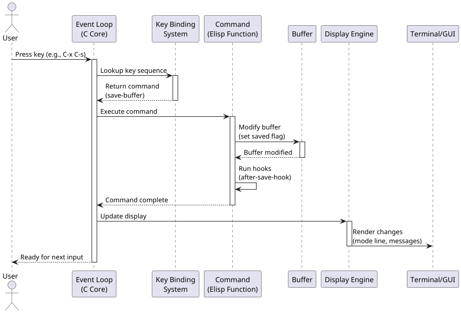

# Emacs Architecture Overview

> **For Software Engineers**: A comprehensive guide to understanding Emacs' architecture for development purposes.

[](https://www.gnu.org/software/emacs/)
[](README.md)
[](INTERNALS.md)

## Table of Contents

- [Introduction](#introduction)
- [Core Architecture Components](#core-architecture-components)
  - [C Core](#c-core)
  - [Emacs Lisp Interpreter](#emacs-lisp-interpreter)
  - [Emacs Lisp Layer](#emacs-lisp-layer)
- [Architecture Diagrams](#architecture-diagrams)
- [Key Architectural Concepts](#key-architectural-concepts)
  - [Buffers](#buffers)
  - [Windows and Frames](#windows-and-frames)
  - [Modes](#modes)
  - [Key Bindings and Command Loop](#key-bindings-and-command-loop)
  - [Hooks and Advice](#hooks-and-advice)
- [Data Flow](#data-flow)
- [What Makes Emacs Architecture Unique](#what-makes-emacs-architecture-unique)
- [Why This Architecture Matters](#why-this-architecture-matters)
- [Getting Started with Emacs Development](#getting-started-with-emacs-development)
- [References and Further Reading](#references-and-further-reading)

## Introduction

Emacs is a highly extensible text editor with a unique architecture that has enabled it to remain relevant for over 40 years. This document provides a comprehensive overview of Emacs' architecture for software engineers who want to understand how Emacs works and how to develop for it.

**Quick Overview:**
- **C Core**: ~5% of codebase - performance-critical primitives
- **Emacs Lisp**: ~95% of codebase - all high-level functionality
- **Architecture**: Layered design with extensibility at every level

For detailed implementation information, see [INTERNALS.md](INTERNALS.md).

## Core Architecture Components

### C Core

**Responsibility**: Fundamental primitives and performance-critical operations  
**Size**: ~5% of Emacs codebase

The C core provides the foundation of Emacs with:

- **Basic data structures** (buffers, windows, frames)
- **Primitive functions** for text manipulation
- **Low-level I/O operations**
- **Event loop and display management**
- **Garbage collector**
- **Interface to the operating system**

> 💡 **For Developers**: The C core is minimal by design. Most functionality you'll develop will be in Emacs Lisp, not C. See [INTERNALS.md - Buffer Internals](INTERNALS.md#buffer-internals) for low-level details.

### Emacs Lisp Interpreter

**Responsibility**: Executes Elisp code

The interpreter is the bridge between the C core and the Elisp layer.

**Features:**
- Dynamic typing
- Lexical and dynamic scoping support
- Built-in evaluation engine
- Byte-code compiler for improved performance

**Performance Tiers:**
- **Interpreted**: 1x (baseline)
- **Byte-compiled**: 5-10x faster
- **Native compiled** (Emacs 28+): 2-3x faster than byte-code

> 💡 **For Developers**: Always byte-compile your packages. Native compilation happens automatically in modern Emacs. See [INTERNALS.md - Byte-code and Compilation](INTERNALS.md#byte-code-and-compilation).

### Emacs Lisp Layer

**Responsibility**: Implements most of Emacs functionality  
**Size**: ~95% of Emacs codebase

The Elisp layer contains the vast majority of Emacs features:

- All editing commands
- Major and minor modes
- User interface elements
- Package system
- Built-in applications (mail, calendar, org-mode, etc.)

**Key Insight**: Most of Emacs (~95%) is written in Elisp, making it highly introspective and modifiable at runtime. This is what makes Emacs so extensible.

## Architecture Diagrams

### Component Architecture


*Shows the layered relationship between UI, Elisp, Interpreter, C Core, and External Systems.*

[View Source: component-architecture.puml](component-architecture.puml)

### Layered Architecture


*Illustrates the vertical stack from hardware to user interface.*

[View Source: layered-architecture.puml](layered-architecture.puml)

### Event Flow



*Sequence diagram showing how user input flows through the system.*

[View Source: event-flow.puml](event-flow.puml)

### Buffer-Window-Frame Relationships


*Explains how buffers, windows, and frames relate to each other.*

[View Source: buffer-window-frame-relationships.puml](buffer-window-frame-relationships.puml)

### Extension Mechanisms


*Shows how hooks, advice, and other extension points work.*

[View Source: extension-mechanisms.puml](extension-mechanisms.puml)

## Key Architectural Concepts

### Buffers

**Definition**: Central data structure representing text being edited

Buffers are not necessarily tied to files. They can contain:
- Program output
- Menus and UI elements
- Interactive applications
- Temporary scratch space

**Key Properties:**
- Each buffer has a unique name
- Independent of display (windows show buffers)
- Can be saved to files or exist only in memory
- Contain text with properties and overlays

> 💡 **For Developers**: Understanding buffers is crucial. See [INTERNALS.md - Buffer Internals](INTERNALS.md#buffer-internals) for the gap buffer implementation and other internal details.

### Windows and Frames

#### Windows
- **Viewports** into buffers
- Multiple windows can show the **same buffer**
- Multiple windows can show **different buffers**
- Can be split horizontally or vertically
- Not OS-level windows (those are "frames" in Emacs terminology)

#### Frames
- **Top-level windows** (what most applications call "windows")
- Can contain **multiple windows**
- Can be in terminal or GUI mode
- Each frame has its own window configuration

> ⚠️ **Terminology Note**: In Emacs, a "window" is a pane inside a frame, not an OS window. This trips up many newcomers.

### Modes

#### Major Modes
- Define **primary behavior** for a buffer
- **Only one** major mode active per buffer
- Examples:
  - `python-mode`
  - `org-mode`
  - `text-mode`
  - `fundamental-mode` (the default, minimal mode)

#### Minor Modes
- Add **optional features**
- **Multiple** minor modes can be active simultaneously
- Examples:
  - `auto-save-mode`
  - `line-number-mode`
  - `flycheck-mode`
  - `company-mode`

**Development Pattern:**
```elisp
;; Major mode skeleton
(define-derived-mode my-mode fundamental-mode "MyMode"
  "Major mode for editing My files."
  (setq-local comment-start "#")
  (setq-local tab-width 4))

;; Minor mode skeleton
(define-minor-mode my-minor-mode
  "Toggle My minor mode."
  :lighter " My"
  :keymap (let ((map (make-sparse-keymap)))
            (define-key map (kbd "C-c m") 'my-command)
            map))
```

### Key Bindings and Command Loop

The event-driven architecture centers around:

- **Key presses invoke commands** (Elisp functions)
- **Highly remappable** keybindings
- **Multiple keymaps** with precedence:
  1. Overriding keymaps
  2. Minor mode keymaps (in order of activation)
  3. Major mode keymap
  4. Global keymap

**First match wins** - this allows modes to override default behavior.

> 💡 **For Developers**: Understanding keymap precedence is essential for creating modes. See [INTERNALS.md - Keymaps and Key Lookup](INTERNALS.md#keymaps-and-key-lookup).

### Hooks and Advice

**Purpose**: Extensibility mechanisms

#### Hooks

Lists of functions called at specific points in execution.

```elisp
;; Example: Add function to hook
(add-hook 'before-save-hook #'delete-trailing-whitespace)
```

**Common hooks:**
- `before-save-hook` - Run before saving a file
- `after-save-hook` - Run after saving a file
- `mode-hook` (e.g., `python-mode-hook`) - Run when entering a mode
- `kill-buffer-hook` - Run when killing a buffer

#### Advice

Mechanism to modify behavior of existing functions without changing their source.

```elisp
;; Example: Add advice to function
(advice-add 'save-buffer :before #'my-pre-save-function)
```

**Advice types:**
- `:before` - Run before the original function
- `:after` - Run after the original function
- `:around` - Wrap the original function (control execution)
- `:override` - Replace the original function entirely

> 💡 **For Developers**: Hooks are for pre-defined extension points. Advice lets you extend any function. Use hooks when available; use advice sparingly.

## Data Flow

```
User Input → Event Loop → Key Binding → Command (Elisp Function)
    ↓                                           ↓
Display ← Screen Rendering ← Buffer Modification
```

### Detailed Flow

1. **User Input**: User presses a key or performs an action
2. **Event Loop**: C core captures the event
3. **Key Lookup**: Key binding system finds associated command
4. **Command Execution**: Elisp function is evaluated
5. **Buffer Modification**: Text or state is changed
6. **Display Update**: Screen is refreshed to show changes
7. **Ready**: System waits for next input

**Complete Data Flow Diagram:**


*See [INTERNALS.md - Display Engine](INTERNALS.md#display-engine-redisplay) for details on the redisplay algorithm.*

## What Makes Emacs Architecture Unique

### Self-documenting System

- Every **function** has documentation accessible via `C-h f`
- Every **variable** has documentation accessible via `C-h v`
- Every **key binding** is inspectable via `C-h k`
- **Source code** is accessible via `M-.` (jump to definition)

This makes Emacs exceptionally learnable and debuggable.

### Live Environment

You can modify Emacs while it's running:
- Evaluate code with `C-x C-e`
- Redefine functions on the fly
- Load and reload packages without restarting
- Change configuration without restarting

This enables a **REPL-driven development** workflow similar to Lisp and Smalltalk environments.

### Everything is Data

- **Text is data** (buffers)
- **Code is data** (homoiconicity of Lisp)
- **Configuration is data** (Elisp expressions)
- All manipulable through Elisp data structures

This uniformity makes programmatic manipulation straightforward.

### Extension = Configuration

No distinction between user configuration and extensions:
- Both are **Elisp code**
- User config (`init.el`) can be as sophisticated as any package
- Packages are just Elisp files
- **Seamless integration** between core, packages, and user code

**Example**: A simple function in your `init.el` has the same power as a built-in function.

## Why This Architecture Matters

### Historical Impact

This architecture has enabled Emacs to:
- Remain relevant for **40+ years**
- Adapt to changing technologies (terminals → X11 → macOS → Wayland)
- Support modern features (LSP, tree-sitter, native compilation)
- Maintain backward compatibility
- Foster a vibrant ecosystem of packages

### Benefits for Different Stakeholders

#### For Users
- **Infinite customization** possibilities
- Learn incrementally (start simple, grow expertise)
- Never "hit a wall" in what you can modify
- Community packages extend functionality

#### For Developers
- **Easy to extend** existing functionality
- Can **inspect and learn** from existing code
- **Rapid prototyping** and testing
- Full access to internals

#### For the Ecosystem
- **Long-term stability** (packages from decades ago still work)
- Package compatibility
- Shared conventions and idioms
- Collective knowledge accumulation

## Getting Started with Emacs Development

### Prerequisites

1. **Install Emacs** (version 24 or later, 28+ recommended)
2. **Basic Elisp knowledge** - Read the [Emacs Lisp Intro](https://www.gnu.org/software/emacs/manual/html_node/eintr/)
3. **Understand the architecture** (you're reading it!)

### Development Workflow

1. **Open Emacs**
2. **Open the `*scratch*` buffer** (for experimentation)
3. **Write Elisp code**
4. **Evaluate with `C-x C-e`** (with cursor after expression)
5. **See results immediately**

**Example Session:**

```elisp
;; Evaluate this (place cursor after closing paren and press C-x C-e)
(message "Hello, Emacs!")  ; => "Hello, Emacs!" in echo area

;; Define a function
(defun my-greeting (name)
  (message "Hello, %s!" name))

;; Test it
(my-greeting "Developer")  ; => "Hello, Developer!"

;; Inspect it
(describe-function 'my-greeting)  ; C-h f my-greeting RET
```

### Key Tools for Development

| Tool | Keybinding | Purpose |
|------|------------|---------|
| Describe function | `C-h f` | See documentation for any function |
| Describe variable | `C-h v` | See documentation for any variable |
| Describe key | `C-h k` | See what command a key runs |
| Jump to definition | `M-.` | View source code of function |
| Evaluate expression | `C-x C-e` | Execute Elisp code |
| Evaluate buffer | `M-x eval-buffer` | Execute all code in current buffer |
| Debugger | `M-x edebug-defun` | Step through function execution |

### Creating Your First Package

**Basic package structure:**

```elisp
;;; my-package.el --- Description of package -*- lexical-binding: t -*-

;; Author: Your Name <your.email@example.com>
;; Version: 1.0
;; Package-Requires: ((emacs "24.4"))
;; Keywords: convenience
;; URL: https://github.com/yourname/my-package

;;; Commentary:
;; This package does something useful.

;;; Code:

(defun my-package-do-something ()
  "Do something useful."
  (interactive)
  (message "Did something!"))

(provide 'my-package)
;;; my-package.el ends here
```

**Best practices:**
- Always use `lexical-binding: t`
- Include proper package headers
- Write docstrings for all functions
- Mark interactive commands with `(interactive)`
- Use `defcustom` for user-configurable variables
- Follow [Elisp Coding Conventions](https://www.gnu.org/software/emacs/manual/html_node/elisp/Coding-Conventions.html)

### Debugging Tips

```elisp
;; Enable debug on error
(setq debug-on-error t)

;; Enable debug on quit (C-g)
(setq debug-on-quit t)

;; Profile your code
(profiler-start 'cpu)
;; ... run your code ...
(profiler-stop)
(profiler-report)
```

### Next Steps

- **Deep dive**: Read [INTERNALS.md](INTERNALS.md) for implementation details
- **Learn Elisp**: Work through the [Emacs Lisp Reference Manual](https://www.gnu.org/software/emacs/manual/html_node/elisp/)
- **Study existing code**: Use `M-.` to jump into built-in functions and read their implementations
- **Join the community**: #emacs on Libera.Chat, r/emacs, emacs-devel mailing list

### Common Development Tasks

| Task | Approach |
|------|----------|
| Add new command | Define function with `(interactive)` and bind to key |
| Customize existing behavior | Use hooks or advice |
| Create new mode | Use `define-derived-mode` or `define-minor-mode` |
| Process text | Use buffer functions (`point`, `mark`, `buffer-substring`, etc.) |
| Integrate external tool | Use process functions (`start-process`, filters, sentinels) |
| Add UI elements | Use overlays, text properties, or the mode line |

## References and Further Reading

### Official Documentation
- [Emacs Lisp Reference Manual](https://www.gnu.org/software/emacs/manual/html_node/elisp/) - Comprehensive reference
- [Emacs User Manual](https://www.gnu.org/software/emacs/manual/html_node/emacs/) - User guide
- Built-in Info system: `C-h i m Elisp RET`

### Source Code
- [Emacs Source Code (GitHub Mirror)](https://github.com/emacs-mirror/emacs)
- [Emacs Source Code (Official Git)](https://git.savannah.gnu.org/cgit/emacs.git)

### Deep Dive Documentation
- [INTERNALS.md](INTERNALS.md) - Low-level implementation details (this repository)

### Community Resources
- [EmacsWiki](https://www.emacswiki.org/) - Community-maintained documentation
- [Reddit r/emacs](https://www.reddit.com/r/emacs/)
- [Emacs StackExchange](https://emacs.stackexchange.com/)
- IRC: #emacs on Libera.Chat

### Learning Resources
- [An Introduction to Programming in Emacs Lisp](https://www.gnu.org/software/emacs/manual/html_node/eintr/)
- [Mastering Emacs](https://www.masteringemacs.org/) by Mickey Petersen
- [Emacs from Scratch](https://www.youtube.com/playlist?list=PLEoMzSkcN8oPH1au7H6B7bBJ4ZO7BXjSZ) by System Crafters

---

## Footnotes

[1] The exact percentage of C vs Elisp code varies by version, but the principle remains: the C core is minimal, and most functionality is in Elisp.

[2] Modern Emacs (28+) includes native compilation support, which compiles Elisp to native code for better performance while maintaining the same architecture.

---

**Want to dive deeper?** Continue to [INTERNALS.md](INTERNALS.md) for detailed implementation information including:
- Gap buffer internals
- Garbage collection algorithm
- Redisplay engine
- Symbol implementation
- Process management
- And much more...

